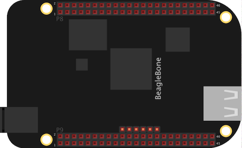

# Generic BeagleBone Support

[](https://circleci.com/gh/nerves-project/nerves_system_bbb)
[](https://hex.pm/packages/nerves_system_bbb)

This is the base Nerves System configuration for the [BeagleBone Black](http://beagleboard.org/black),
[BeagleBone Green](http://beagleboard.org/green), [BeagleBone Green Wireless](https://beagleboard.org/green-wireless/),
and [PocketBeagle](https://beagleboard.org/pocket).


<br><sup>[Image credit](#fritzing)</sup>

| Feature              | Description                     |
| -------------------- | ------------------------------- |
| CPU                  | 1 GHz ARM Cortex-A8             |
| Memory               | 512 MB DRAM                     |
| Storage              | 4 GB eMMC Flash and MicroSD     |
| Linux kernel         | 6.6 w/ "ti" patches             |
| IEx terminal         | UART `ttyS0`                    |
| GPIO, I2C, SPI       | Yes - [Elixir Circuits](https://github.com/elixir-circuits) |
| ADC                  | Yes                             |
| PWM                  | Yes, but no Elixir support      |
| UART                 | ttyS0 + more via device tree overlay |
| Camera               | None                            |
| Ethernet             | Yes                             |
| WiFi                 | Beaglebone Green Wireless (wl18xx driver). Other requires USB WiFi dongle/driver |
| HW Watchdog          | AM335x watchdog enabled on boot. Be sure to enable `heart` in your vm.args or the device will reboot |

## Using

The most common way of using this Nerves System is create a project with `mix
nerves.new` and to export `MIX_TARGET=bbb`. See the [Getting started
guide](https://hexdocs.pm/nerves/getting-started.html#creating-a-new-nerves-app)
for more information.

If you need custom modifications to this system for your device, clone this
repository and update as described in [Making custom
systems](https://hexdocs.pm/nerves/customizing-systems.html).

## Preparing your BeagleBone

If your BeagleBone has eMMC (the PocketBeagle doesn't), it will be configured to
try the eMMC first when looking for software on boot. If you haven't
reprogrammed it, it will boot to Debian even if a MicroSD card is inserted with
good software. To boot from the MicroSD card, hold down the USER button and
apply power.

When starting with Nerves, you will find that booting from a MicroSD card is
convenient since you can easily recover from broken software images. Holding
down the USER button will get old. To force the BeagleBone to boot from the
MicroSD card, simply corrupt the image on the eMMC memory.  Don't worry, the
BeagleBone website has instructions for restoring Debian.

From Debian:

```bash
debian@beaglebone:~$ sudo dd if=/dev/zero of=/dev/mmcblk0 bs=1M count=100
100+0 records in
100+0 records out
104857600 bytes (105 MB) copied, 5.72098 s, 18.3 MB/s
debian@beaglebone:~$ sudo reboot
```

When it reboots, it will boot from the MicroSD slot. If a MicroSD card hasn't
been inserted or if there are errors reading it, you will see the letter `C`
printed repeatedly on the console port.

## Console access

The console is configured to output to the 6 pin header on the
BeagleBone that's labeled J1. A 3.3V FTDI cable is needed to access the output.

The HDMI output has been disabled via device tree to free up pins on the GPIO
header. If you would like console access via HDMI, you will need to enable HDMI
support in the Linux kernel, remove the HDMI disable argument in the uboot
script providing kernel arguments, and change `erlinit.conf` to output to
`tty1`.

## Provisioning devices

This system supports storing provisioning information in a small key-value store
outside of any filesystem. Provisioning is an optional step and reasonable
defaults are provided if this is missing.

Provisioning information can be queried using the Nerves.Runtime KV store's
[`Nerves.Runtime.KV.get/1`](https://hexdocs.pm/nerves_runtime/Nerves.Runtime.KV.html#get/1)
function.

Keys used by this system are:

Key                    | Example Value     | Description
:--------------------- | :---------------- | :----------
`nerves_serial_number` | `"12345678"`       | By default, this string is used to create unique hostnames and Erlang node names. If unset, it defaults to part of the BBB's serial number.

The normal procedure would be to set these keys once in manufacturing or before
deployment and then leave them alone.

For example, to provision a serial number on a running device, run the following
and reboot:

```elixir
iex> cmd("fw_setenv nerves_serial_number 12345678")
```

This system supports setting the serial number offline. To do this, set the
`NERVES_SERIAL_NUMBER` environment variable when burning the firmware. If you're
programming MicroSD cards using `fwup`, the commandline is:

```sh
sudo NERVES_SERIAL_NUMBER=12345678 fwup path_to_firmware.fw
```

Serial numbers are stored on the MicroSD card so if the MicroSD card is
replaced, the serial number will need to be reprogrammed. The numbers are stored
in a U-boot environment block. This is a special region that is separate from
the application partition so reformatting the application partition will not
lose the serial number or any other data stored in this block.

Additional key value pairs can be provisioned by overriding the default
provisioning.conf file location by setting the environment variable
`NERVES_PROVISIONING=/path/to/provisioning.conf`. The default provisioning.conf
will set the `nerves_serial_number`, if you override the location to this file,
you will be responsible for setting this yourself.

## Linux and U-Boot versions

The BeagleBone Black has many options for Linux that vary by kernel version and
patch set. Nerves tracks those maintained by Robert Nelson at
[eewiki.net](https://eewiki.net/display/linuxonarm/BeagleBone+Black).

Nerves also integrates the BeagleBone Black's U-boot patches to support device
tree overlays. Support mirrors the BeagleBone docs with the exception that to
set U-boot environment variables, See the section below for more information.

## Device tree overlays

Most pins on the BBB's headers are configurable via a mechanism called the
device tree. The device tree is made up of device tree files and overlay files
that get compiled down into one or more `.dtb` or `.dtbo` files. The files tell
Linux what drivers to load and what parameters to use for things that it can't
figure out by itself.

There are two strategies for dealing with the device tree:

1. Modify the device tree files for an existing board to make your own
2. Load device tree overlay files

Upstream BBB encourages the second option since it can be easier. The tradeoff
is that if anything goes wrong or your hardware doesn't match their assumptions,
it's a little harder to debug.

The device tree files are loaded by U-Boot. Nerves installs all of the
Beagleboard overlay files to `/lib/firmware` and configures U-Boot to closely
match upstream. This means that most of the upstream documentation on device
tree is usable. The difference is that instead of using `/boot/uEnv.txt` to
customize the overlays, you need to set the variables in the U-Boot environment
block. This can be done by running `cmd("fw_setenv <key> <value>")` from the IEx
prompt or by adding the variables to the `fwup_include/provisioning.conf` file.

For example, at the IEx prompt:

```elixir
cmd("fw_setenv uboot_overlay_addr7 /lib/firmware/BB-UART1-00A0.dtbo")
```

Or by updating the configuration file:

```
uboot_setenv(uboot-env, "uboot_overlay_addr7", "/lib/firmware/BB-UART1-00A0.dtbo")
```

See
[elinux.org/Beagleboard:BeagleBoneBlack_Debian](https://elinux.org/Beagleboard:BeagleBoneBlack_Debian#U-Boot_.2Fboot.2FuEnv.txt_configuration)
for documentation on the variables.

### Universal I/O

The BBB's Universal device tree overlay lets you configure pins at runtime. This
system enables the universal overlay by default. See the
`enable_uboot_cape_universal` setting in the default `fwup_include/provisioning.conf` file.

See
[beaglebone-universal-io](https://github.com/cdsteinkuehler/beaglebone-universal-io)
for documentation. You'll see references to an RCN-built kernel. RCN is the
initials for Robert Nelson and we use his kernel patches.

### ADCs

The following example shows how to read values from the 7 ADC inputs in Elixir.
You will first need to load "BB-ADC" device tree overlay using the guide described
above.

```elixir
iex(nerves@nerves-0014.local)> ls "/sys/bus/iio/devices/iio:device0"
buffer              dev                 in_voltage0_raw     in_voltage1_raw
in_voltage2_raw     in_voltage3_raw     in_voltage4_raw     in_voltage5_raw
in_voltage6_raw     name                of_node             power
scan_elements       subsystem           uevent
iex(nerves@nerves-0014.local)> File.read("/sys/bus/iio/devices/iio:device0/in_voltage0_raw")
{:ok, "3891\n"}
iex(nerves@nerves-0014.local)> File.read("/sys/bus/iio/devices/iio:device0/in_voltage0_raw")
{:ok, "3890\n"}
iex(nerves@nerves-0014.local)> File.read("/sys/bus/iio/devices/iio:device0/in_voltage0_raw")
{:ok, "3891\n"}
```

### SPI

The following examples shows how to get SPI0 functional in Elixir.

Load the "BB-SPIDEV0" device tree overlay using the guide described above.

Verify that the device drivers are loaded and read spi0 transfers:

```elixir
iex(nerves@nerves-0014.local)> ls "/dev"
  ...
        spidev1.0              spidev1.1              spidev2.0              spidev2.1
  ...
iex(nerves@nerves-0014.local)> File.read "/sys/bus/spi/devices/spi1.0/statistics/transfers"
{:ok, "0"}
```

If you have included [circuits_spi](https://github.com/elixir-circuits/circuits_spi) as a
dependency, you can start it now and test a transfer:

> The example below should work without any additional hardware connected to the
> BBB. If you have SPI hardware connected to the BBB, your returned binary might
> be different.

```elixir
iex(nerves@nerves-0014.local)> {:ok, ref} = Circuits.SPI.open("spidev0.0")
{:ok, #Reference<...>}
iex(nerves@nerves-0014.local)> Circuits.SPI.transfer(ref, <<1,2,3,4>>)
<<255, 255, 255, 255>>
```

> Note: If you get back all 0's, then you have likely have not configured the
> overlay pins correctly.

## PRUS

The PRUs are controlled via `uio`. Two kernel modules are needed for them to work.

```elixir
iex> :os.cmd('modprobe uio uio_pruss')
iex> ls "/sys/class/uio"
uio0     uio1     uio2     uio3     uio4     uio5     uio6     uio7
```

Check the beaglebone [am335x_pru_package](https://github.com/beagleboard/am335x_pru_package/)
repository for samples on how to interface PRUs.

## Supported USB WiFi devices

The base image includes drivers and firmware for the TI WiLink8 (`wl18xx`),
Ralink RT53xx (`rt2800usb` driver) and RealTek RTL8712U (`r8712u` driver)
devices. All WiFi drivers are compiled as modules. Some drivers can be loaded
automatically. If you have a Beaglebone Green or Beaglebone Black with built-in
WiFi, see the next section.

We are still working out which subset of all possible WiFi dongles to support in
our images. At some point, we may have the option to support all dongles and
selectively install modules at packaging time, but until then, these drivers and
their associated firmware blobs add significantly to Nerves release images.

If you are unsure what driver your WiFi dongle requires, run Raspbian and
configure WiFi for your device. At a shell prompt, run `lsmod` to see which
drivers are loaded.  Running `dmesg` may also give a clue. When using `dmesg`,
reinsert the USB dongle to generate new log messages if you don't see them.

## Bluetooth

The Beaglebone boards with built-in WiFi support use the WiLink8 WL1835 module.
This is a combo WiFi/Bluetooth module. Bluetooth is not well supported in
Nerves. However, Nerves is built on Linux so you can enable and use `bluez`.
Another option is to use [harald](https://hex.pm/packages/harald) which can
communicate with the module using low level Bluetooth HCI commands.

The WL1835 requires initialization before first use. This is done via a "BTS"
file. The `TIInit_11.8.32.bts` file is included in this system under
`lib/firmware/ti-connectivity`. The Bluetooth kernel modules know how to load it
automatically. If you're using `harald`, you will need to load it yourself. The
source of the "BTS" file is http://www.ti.com/tool/wl18xx-bt-sp.

[Image credit](#fritzing): This image is from the [Fritzing](http://fritzing.org/home/) parts library.

## NervesKey

Using NervesKey on an I2C bus requires the bus speed to be lowered. This can be
done using uboot overlays specific to the I2C bus that NervesKey is attached
to. The device tree blob can be found in `/lib/firmware`.

Choose one of the following:

```text
uboot_setenv(uboot-env, "uboot_overlay_addr4", "/lib/firmware/i2c1-clock-frequency-100khz.dtbo")
uboot_setenv(uboot-env, "uboot_overlay_addr5", "/lib/firmware/i2c2-clock-frequency-100khz.dtbo")
```

You can configure your project to enable these device tree overlays by copying the
`fwup_include/provisioning.conf` file to your project, updating the file to
enable the uboot overlay for your NervesKey i2c bus, and by adding the following
to your Mix Application configuration:

```elixir
config :nerves, :firmware,
  provisioning: "project/relative/path/to/provisioning.conf"
```
